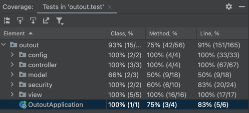
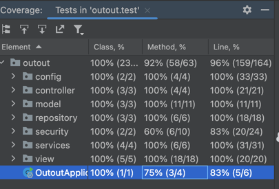

# Testing Debt Documentation

## Overview
This project contains only integration tests for controller layer, due to high coupling between the controller and the service layer. The service layer is not tested, and the integration tests are not implemented.

> [!NOTE]
> Given this situation, it is necessary to do a refactoring to decouple the controller and the service layer, and implement integration tests.
> Even though there are no tests for the service layer, the project contains a good coverage in overall.

## Testing Debt
- Integration tests are implemented but are not clear.
- There are no Unit tests for service or repository layer.
- There are no performance tests
- There are no security tests (Injections, XSS, etc)

> [!IMPORTANT]
> For this exersice, we are going to focus on unit testing service and repository layer and complete the coverage on some model classes.

## Testing Strategy 
- **Refactoring**: We are going to refactor the code to decouple the controller and the service layer.

- **Unit Testing**: We are going to implement unit tests for the service and repository layer.

## Results:
- **Refactoring**: The refactoring was successful, and the controller and the service layer are decoupled. you can see that in [services](src%2Fmain%2Fjava%2Foutout%2Fservices) folder and in [repository](src%2Fmain%2Fjava%2Foutout%2Frepository) folder, there are injected using Springs `@Autowired` Dependency Injection.
- **Unit Testing**: I implemented unit tests for the service layer in [unit tests](src%2Ftest%2Fjava%2Foutout%2Funit), and we achieved a good coverage in overall. 
- **Integration Testing**: I updated the integration tests for the controller layer in [integration tests](src%2Ftest%2Fjava%2Foutout%2Fintegration), and now, the integration tests have more sense and are more clear validating status codes.
