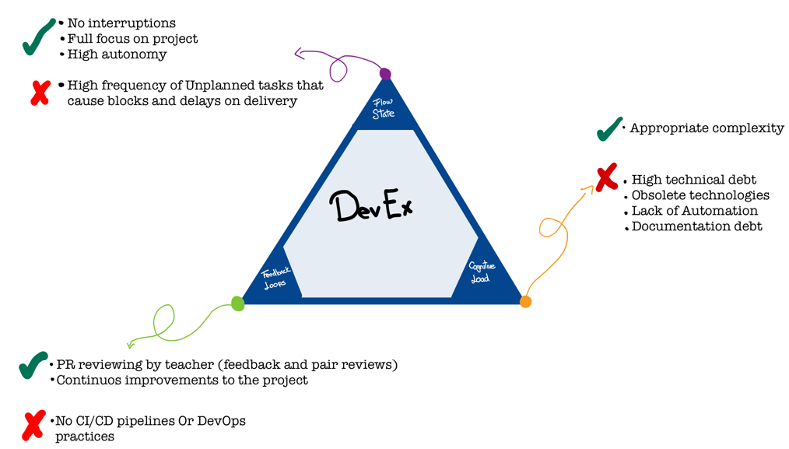
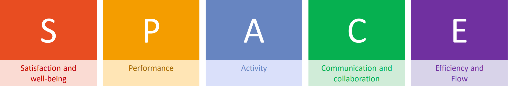
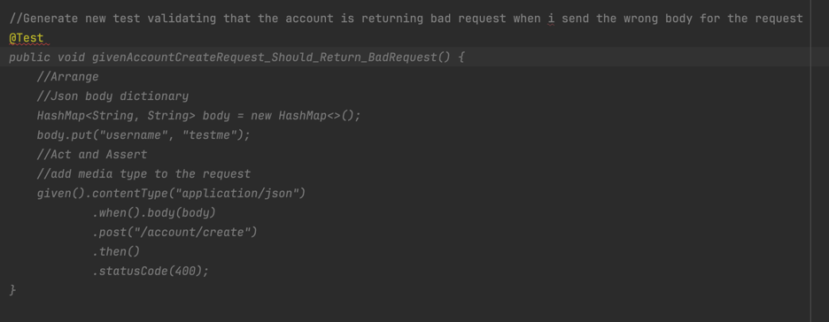
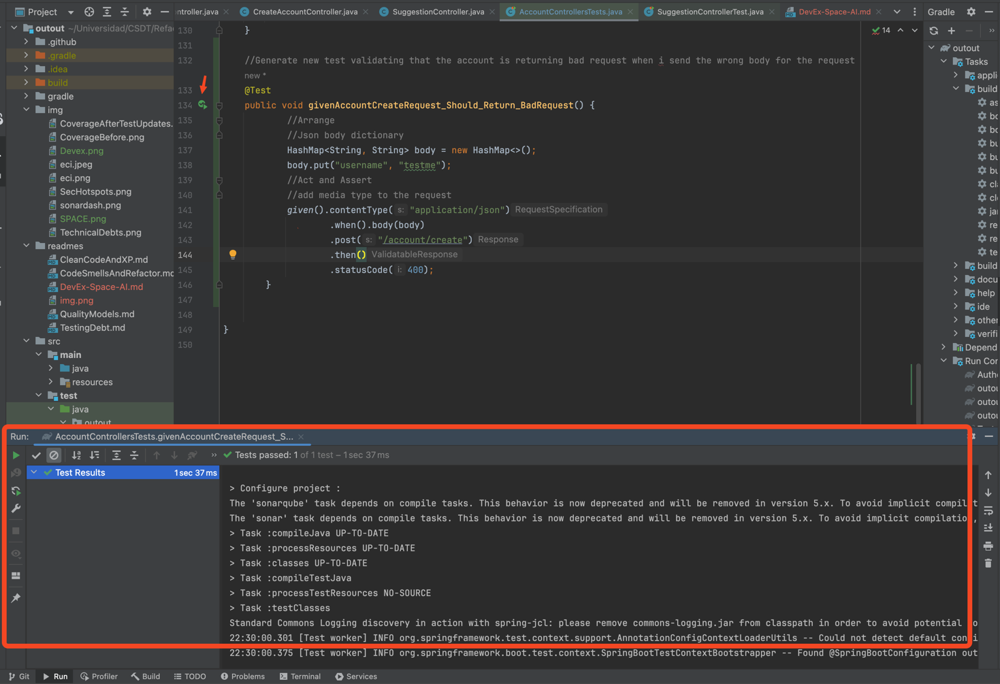
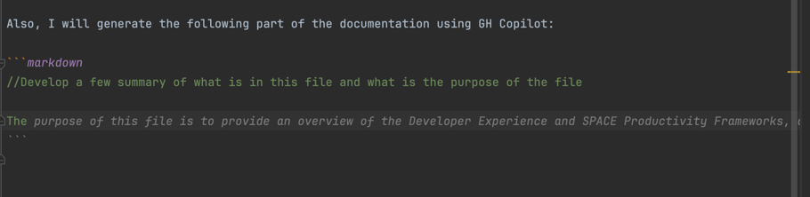

# Developer Experience Analysis

##  Overview
The following image shows the main pillars of the Developer Experience, and some key points that were identified in the project.



### Flow State

In the project, flow state was achieved by focusing only in the task in hand, and iterate over the code to improve the quality of the project. But is important to note that as long as the project was developed by a single person, the project contains some unplaned refactorings that were not in the initial plan, and this can be a problem in a real project, because the time is a key factor in the development process.

### Feedback

Feedback was provided by the teacher, who reviewed the code and provided feedback on the code quality, design, and implementation. This feedback was crucial to identify areas for improvement and to ensure that the project met the requirements and quality standards, but is important to note that the feedback was provided asynchronously, so the feedback was not immediate and **at the beginning of the project** there were no CI/CD or a complete DevOps pipeline to provide feedback.

### Cognitive Load 

The cognitive load was managed by breaking down the tasks into smaller, manageable pieces, and focusing on one task at a time. This approach helped to reduce the complexity of the project and allowed for better focus and concentration on each task. This project is developed by a single person, so all the cognitive load was managed by the developer, but in a real project, the cognitive load should be distributed among the team members to avoid burnout and ensure that the project is completed on time.


# SPACE Productivity Analysis

## Overview
The following image shows the main pillars of the SPACE Productivity Framework.



### Satisfaction and Well-being

The project was developed with a focus on improving code quality, maintainability, and test coverage. This focus helped to increase the satisfaction of the developer by reducing the technical debt, improving the code quality, and ensuring that the project met the requirements and quality standards, however, the project contains a lot of unplanned refactorings that affected the well-being of the developer.

### Performance

The performance of the project was improved by implementing unit tests for the service layer and updating integration tests for the controller layer. This helped to identify and address issues early in the development process, and ensure that the project met the performance requirements. The project now has a better overview of code quality and maintainability.


### Activity

The code smell detection and refactoring activities helped to identify some key issues in the project that eventually were solved by using the Clean Code Principles and XP practices. The Testing Debt activity helped to address the lack of testing in the project and improve the overall test coverage.

[QualityModels.md](QualityModels.md) Shows that in the project was implemented Sonarcloud and Github Actions to monitor the code quality and automate part of the build process, this helped to get a better overview of the code quality and maintainability of the project.

### Comunication and Collaboration

The project was developed by a single person, so the communication and collaboration were limited to the feedback provided by the teacher. In a real project, communication and collaboration among team members are crucial to ensure that the project meets the requirements and quality standards, and that the team members are aligned with the project goals and objectives.

### Efficiency and Flow

there were no interruptions to the developer like calls or meetings, so the developer was able to focus on the main tasks.

# Identified Metrics

- **Code Smell frequency**: This metric can be used to check the frequency of code smells in the project as long as is developed, this let us identify code that need to be improved and the quality of the development delivered.
- **Code Coverage**: This metric can be used to check the test coverage of the project, and identify areas that need more testing.
- **Automation Percentage**: This metric can be used to check the percentage of the build process that is automated and the time it takes to execute, that let us identify areas that need more automation.
- **Documentation Quality**: This metric can be used to check the quality of the project documentation, and identify areas that need documentation improvement.
- **Time to Resolve Issues**: This metric can be used to check the time it takes to reslve issues by the developer and identify the complexity of the project.


# AI Tools - GH Copilot

In [QualityModels.md](QualityModels.md) I mentioned that I used Github Copilot to help me with the Github Actions workflow ([main.yml](..%2F.github%2Fworkflows%2Fmain.yml)), it was very helpful to understand the syntax and the steps that I had to follow to implement the workflow, I had to check and modify some steps to fit the project needs and be able to use the workflow.

As excersice, I will generate a new integration test 


and the result of the test execution is the following:



Also, I will generate the following part of the documentation using GH Copilot:

```markdown
//Develop a few summary of what is in this file and what is the purpose of the file

The purpose of this file is to provide an overview of the Developer Experience and SPACE Productivity Frameworks, and to analyze the project based on these frameworks. 
The file contains a summary of the main pillars of the Developer Experience and SPACE Productivity Frameworks, and key points that were identified in the project based on these frameworks. The file also includes an analysis of the flow state, feedback, cognitive load, satisfaction and well-being, performance, activity, communication and collaboration, and efficiency and flow in the project, and how these factors contributed to the overall productivity of the project.
```

You can see the suggestion here: 


So in conclusion, Copilot is very usefull to develop some code and documentation parts, but is important to note that the suggestions are not always correct, so the developer should review the suggestions and modify them to fit the project needs.