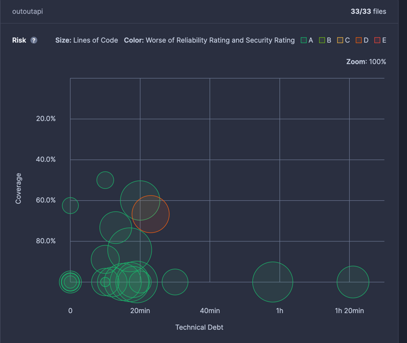

# Quality Models (Sonarcloud + GH Actions)

## Sonarcloud BADGE! 🎉 

## Github Actions Badge! 🔧

## Overview

In this branch I have implemented the sonarcloud and github actions integrations to improve the quality of the project.

> [!NOTE]
> Due to inconvenients with the permissions of this organization, the exercise will be replicated in my personal account, but the code will be the same.
> You can find the sonarcloud analysis [here](https://sonarcloud.io/summary/new_code?id=andres-marcelo-csdt-project_outout-api) also, can see the GH Actions [here](https://github.com/AndresMarcelo7/outoutapi/actions). As soon as the permissions are granted, I will update the links 😉.

## Sonarcloud Analysis Findings

> [!TIP]
> Code smells, Vulnerabilities and Security Hotspots will be kept as a reference for the final delivery of the project, so the project will be updated to improve the quality of the code.
> **The code coverage was improved in the [TestingDebt.md](TestingDebt.md)**

The Sonarcloud analysis provides a detailed overview of the code quality, security, and maintainability of the project. Here are some of the key findings from the analysis:

1. **Compatibility** - SonarCloud and its plugins are only compatible with java versions above 11, so the project was updated to use Java 21.
> [!NOTE]
> 🤕 At the beginning of the project, java version was 8! so I had to update the version and with this, I had to update the dependencies and some code that was deprecated, another refactoring exercise that was not planned and was pretty diffiult.
> Also, The integration tests that were implemented were not compatible with the new version of java, so I had to update them too.
2. **Code Coverage** - Sonarcloud doesn't provide code coverage as itself, but it can be integrated with other tools like JaCoCo ✅ to provide this information. In this case, the project has a good coverage, but it can be improved.
3. **Code Smells** - The analysis identified several code smells in the project, including:
    - **Unused Imports** - Some variables are declared but never used in the project, which can clutter the codebase and reduce readability.
    - **Spring annotations** - Some classes are annotated with `@Controller` that are deprecated and should be replaced with `@RestController`.
    - **Unrequired Parentheis** - Some methods have unnecessary parentheses that can be removed to improve code readability.
    - **Unused Variables** - Some variables are declared but never used in the project, which can clutter the codebase and reduce readability.
4. **Technical Debt** - The analysis identified various instances of technical debt in the project, you can see here:

where the most of the bets can be solved under 20 minutes.
5. **Security Vulnerabilities** - With the refactor, I solved some of the vulnerabilites, but it was detected  a security hotspot:

But this is a sample project and the security is not a priority, so this will be kept as a reference for the final delivery of the project.

## Github Actions
Github Actions was implemented to automate the build process of the project, so every time a push is made to the repository, the project is built and tested automatically. The workflow includes Sonarcloud integration steps so every commit pushed to an specific branch, it was loaded to the sonarcloud analysis, it was very helpfull to see the results of the refactorings and the improvements in the code quality.

## Github Copilot
As I am new to github actions, I used github copilot to help me with the workflow, it was very helpfull to understand the syntax and the steps that I had to follow to implement the workflow, obviusly I had to modify some steps to fit the project needs, but it was a good start point.